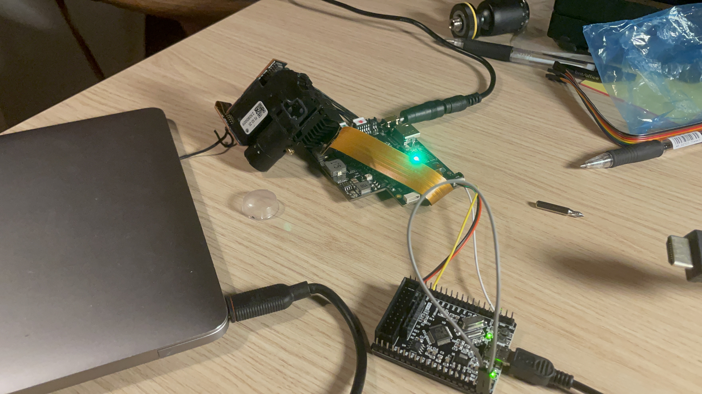
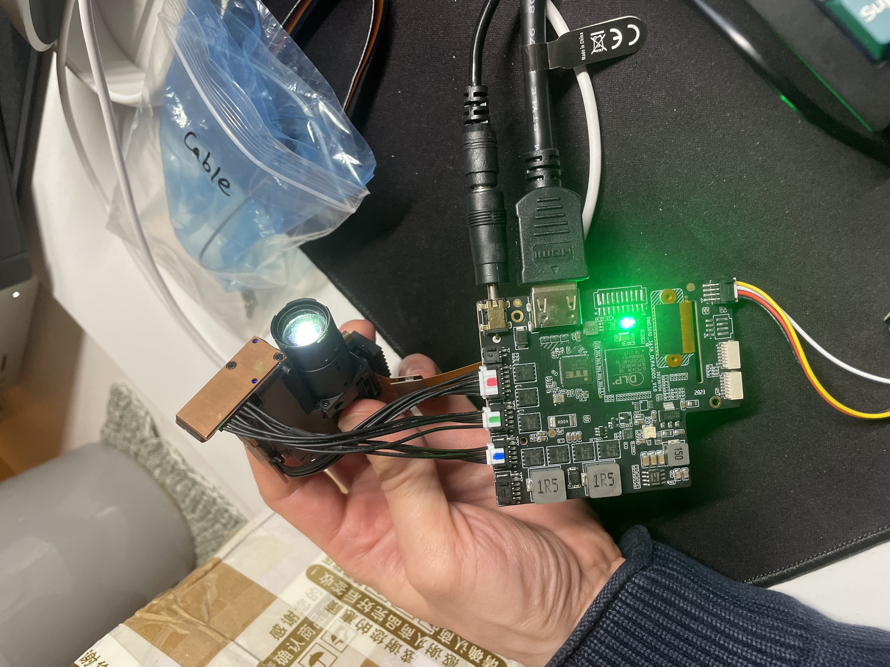
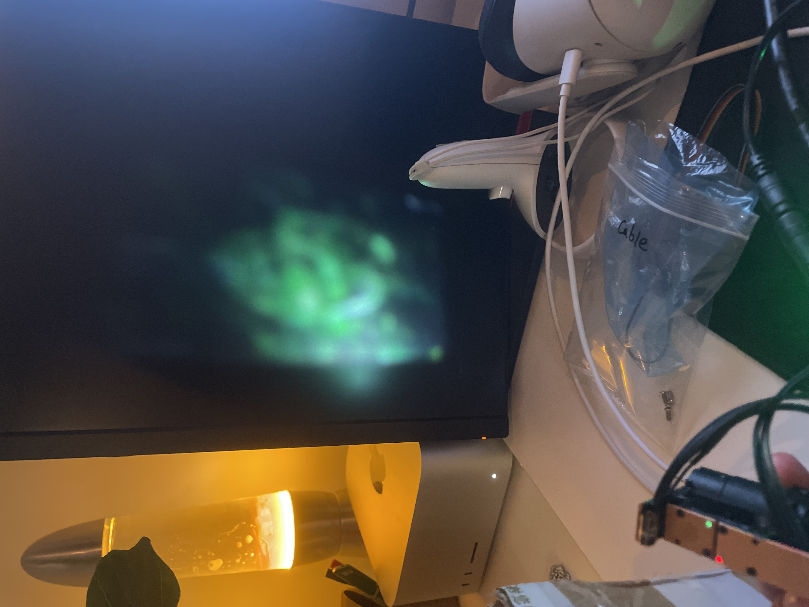
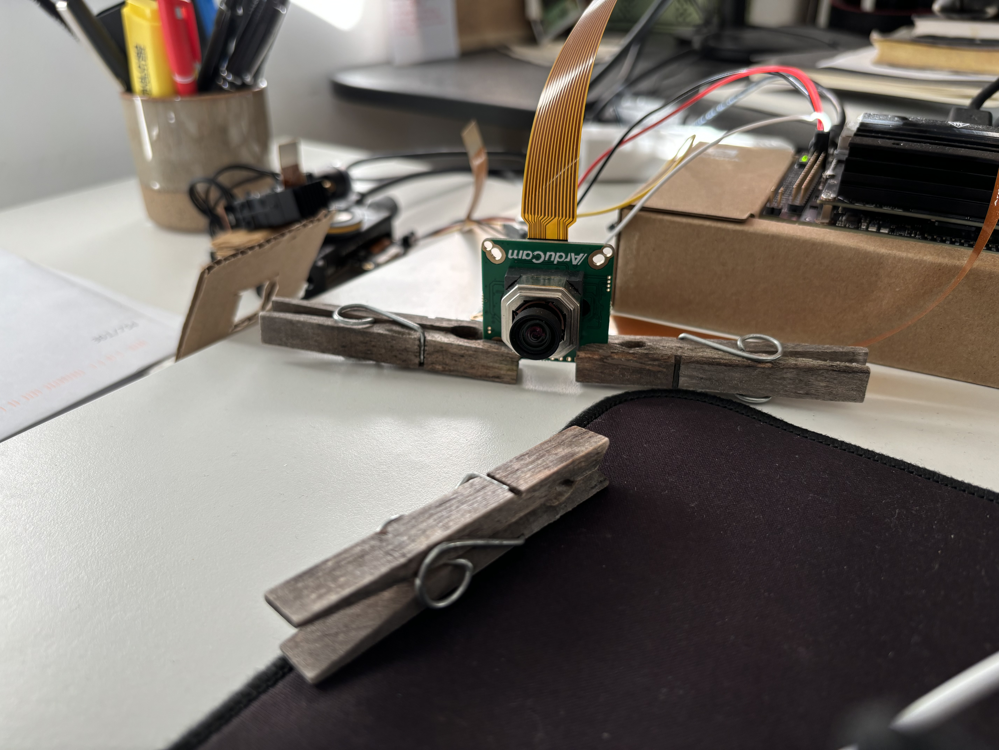
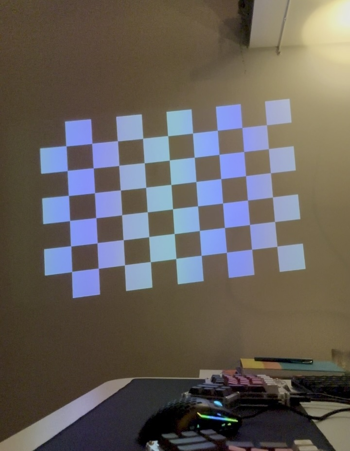
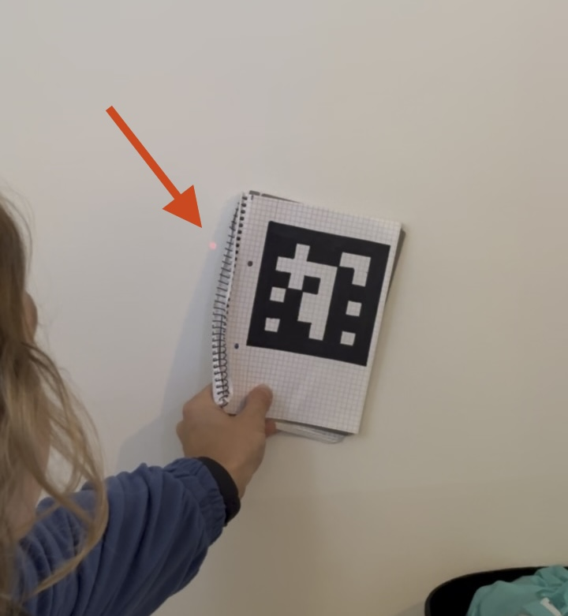
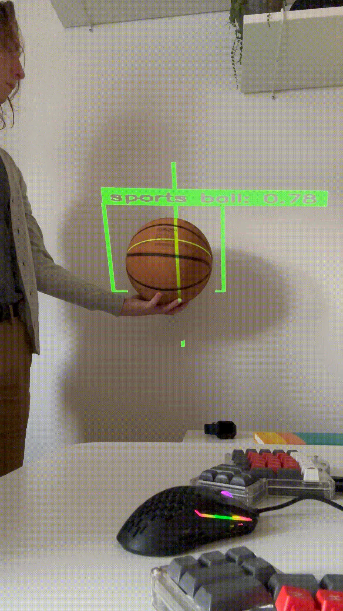

# Lmbic — Interactive Projection System

A passion project that explores spatial AR through projection mapping: an
NVIDIA Jetson, two cameras, and a DLP projector packaged into a lamp-style
form factor that points at a desk or a wall and projects context-aware
overlays onto whatever sits below it.

This is a write-up of the implementation journey. It is intentionally
high-level — the project is still being pursued by others as a startup
without me — so I describe outcomes, challenges, and the shape of the
solutions, not the specifics that may carry commercial value.

The story is split into chapters. This is chapter one.

---

## 1. Hardware bring-up

When I joined the project we had freshly received the hardware and a
not-yet-working pile of components on a desk. The goal of this first
milestone was simple to state and surprisingly hard to reach: connect
everything together, drive it from a single computer, and get the projector
to display a frame that originated on that computer.

### What was on the desk

**Display path.** An [eViewTek P2](https://www.eviewtek.com/) optical engine
containing a Texas Instruments digital micromirror device (DMD), driven by a
TI DLPC controller mounted on a driver board. The same driver board carries
an [ITE IT6801FN](https://www.ite.com.tw/en/product/cate1/IT6801) HDMI
receiver responsible for accepting the video signal that the DLPC ultimately
projects.

**Capture path.** Two
[Arducam IMX477](https://www.arducam.com/arducam-12mp-imx477-motorized-focus-high-quality-camera-for-jetson.html)
12-megapixel cameras with motorised focus, intended to give the system its
view of the world below the lamp.

**Compute.** An NVIDIA Jetson Nano Developer Kit, talking to the projector's
driver board over I²C for control and HDMI for the video signal, and to the
cameras over MIPI CSI-2.

### The MCU died

The driver board ships with a small microcontroller whose only job is to run
the DLPC's initialisation sequence at boot. Within days of receiving the
hardware that microcontroller failed in a way we could not recover from. The
projector was inert: video signal arriving on HDMI had nowhere to go, and we
had no path to reach the DLPC to bring it up another way.

The manufacturer was not responsive on the timescales we needed. We had no
full register-level documentation for the driver board as a system. Buying a
second unit and waiting for it to arrive was an option but a slow one, and
it would not solve the underlying problem the next time something blew up.
We needed a path that did not depend on the original MCU at all.

### Pivoting onto the TI reference design

eViewTek manufactures the optical engine, but the rest of the driver board
is built on a publicly documented Texas Instruments reference design — the
same one TI publishes for evaluation kits using their DLP chips. That
reference design comes with an open initialisation routine: how to wake the
DLPC up, how to configure the HDMI receiver feeding it, and the order in
which all of that has to happen.

The catch was that the reference code targets the original MCU. Our compute
sat on the other side of the I²C lines, on the Jetson, running Linux. We
re-targeted the boot sequence:

- Replaced the bare-metal MCU communication layer with Linux-side I²C
  transactions issued from the Jetson, using the kernel's standard interface
  to the bus
- Kept the high-level initialisation logic — register sets, sequence order,
  timing — from the reference
- Resolved the differences the reference did not cover: bus discovery,
  device addressing on the specific layout we had, and the ITE part's own
  configuration (for which we never found a programming guide and inferred
  enough behaviour from the reference code to make it work)

After enough iteration, an HDMI signal sent from the Jetson found its way
through the ITE receiver, into the DLPC, and out of the optical engine as a
projected image. First light.

### Cameras: the same shape of problem, smaller scale

The cameras went through their own less dramatic but similarly trial-and-
error pass. The IMX477 sensor is well-supported in the Linux ecosystem but
not entirely plug-and-play on the Jetson Nano: it needs the
[RidgeRun V4L2 driver](https://developer.ridgerun.com/wiki/index.php?title=Raspberry_Pi_HQ_camera_IMX477_Linux_driver_for_Jetson),
the right capture pipeline (NVIDIA's Argus API and the
hardware-accelerated GStreamer plugins), and a careful pass over focus —
manual coarse adjustment first, then software-driven fine adjustment, since
the motorised range is too narrow to reach focus from cold on its own.

### Outcome

We ended this chapter with a closed loop: cameras feeding pixels into the
Jetson; the Jetson driving the DLPC over I²C and pushing video into it over
HDMI; the projector drawing whatever the Jetson asked it to. None of it was
yet doing anything intelligent — but the substrate was finally there, and
everything that follows is software.

---

## 2. First closed loop

With the substrate working, the next milestone was to make the components
function as a _system_ — not just as parts on the same desk that happen to
be wired up. Concretely: capture frames from the cameras, project something
computed from those frames back into the world, and have it land where you
actually intended it to.

### Calibration: from two views to one space

The cameras and the projector each see the world through their own
coordinate system. To project something at a place a camera observed, we
need a transformation between the two — a way to take a pixel the camera
saw and answer "where does that go on the DMD".

For a flat surface like a desk seen by a fixed camera and lit by a fixed
projector, that transformation is well captured by a
[homography](https://en.wikipedia.org/wiki/Homography_(computer_vision)) —
a 3×3 matrix you can derive from a small set of corresponding points seen
from both sides. The classical way to find those correspondences: project a
known pattern (a checkerboard) and have the camera observe it. From there,
solving for the homography is a textbook OpenCV call.

We initially planned to also correct for camera lens distortion — the
standard radial / tangential model you fit from the same calibration
images — but the residuals at the scale and geometry we cared about were
small enough that doing so would not have changed any downstream decision.
We left distortion correction out for the prototype and moved on.

### A first interactive sketch: ArUco markers

The simplest possible "the projector is reacting to the world" demo:

- Place
  [ArUco fiducial markers](https://docs.opencv.org/4.x/d5/dae/tutorial_aruco_detection.html)
  on the desk
- Detect them in the camera frames with OpenCV's marker detector (cheap,
  reliable, works at video rate)
- Map each detected marker corner from camera space into projector space
  using the homography we just calibrated
- Project a box around it

This was small in scope on purpose — ArUco markers are a developer's tool,
not a product feature — but it was enough to exercise the entire loop:
camera frame in, computer-vision step in the middle, projector frame out.
If the box sits where the marker is, every link in the chain is healthy.

### First POC

When we ran the loop end-to-end for the first time and moved a marker
around the desk while a glowing rectangle followed it across the surface,
the project quietly tipped over from "a pile of components on a desk" to
"an interactive projection system". Modest in what it _did_ — but the
substrate, the calibration, the capture pipeline, the rendering pipeline,
and the projector were all now working together. The first proof of
concept of Lmbic.

>
> _**Disclaimer:** the only photo I have from this milestone is from an
> earlier iteration of the demo — projecting a single dot at one known
> camera-space corner of each marker, before I extended it to draw the full
> rectangle. As a proof that the calibration was working end-to-end it was
> already conclusive: a dot landing exactly where it was asked to means
> every link in the chain is healthy._

### Outcome

A working closed-loop interactive projection prototype. Anything we wanted
to project on top of the world from here on was, in principle, the same
flow with a different middle step.

---

## 3. Replacing markers with real objects

ArUco markers are scaffolding. For the system to do anything useful in a
real environment it has to react to ordinary objects — a coffee cup, a
keyboard, a hand — without anyone first taping a fiducial onto them. That
calls for real-time object detection.

### YOLO as the natural fit

[YOLO](https://github.com/ultralytics/ultralytics) is a well-supported
family of real-time object detectors. Pretrained weights cover the COCO
classes, which between them name most things you'd plausibly find on a
desk. From the pipeline's point of view the change was almost mechanical:
swap the ArUco detector in the middle of the loop for a YOLO inference
step, take the bounding boxes and labels it returns, and feed those into
the same homography-and-project flow that already worked for markers.

That was the easy part.

### The Jetson Nano environment is a maze

We wanted YOLO running directly on the Nano alongside the rest of the
host-side software. Two related problems made that surprisingly difficult.

The first is structural. The Jetson Nano is built around the older Tegra
X1 SoC, and its last supported Jetpack release is well behind current. The
host OS, CUDA, and the surrounding system libraries are all pinned to that
release. Newer ML toolchains assume newer versions of those libraries —
and there is no upgrade path for the Nano specifically, because the
hardware is end-of-life from NVIDIA's side. You can't fix the version
mismatch by updating the system; the system is the version it is.

The second is practical. ARM `aarch64` Python wheels for the libraries you
need to build a CV/ML pipeline are inconsistently published — you often
can't `pip install opencv-python` and have it just work, because no wheel
exists for your architecture and Python version. The realistic options
become: use NVIDIA's package repository (often an older release than
upstream), build from source on the Nano (slow), or sidestep the host
environment entirely.

### Docker as the workaround

We ran YOLO inside a Docker container with exactly the library versions it
expected, and left the rest of the host environment alone. Container
runtime overhead was negligible against the inference cost, and the setup
was reproducible across machines — meaning the same image would boot
identically on whatever development board we plugged in next.

### Talking to the container with gRPC

Once YOLO lives in its own process, the host needs a way to ship camera
frames in and pull detections back out at video rate. We used
[gRPC](https://grpc.io/) for that boundary: schema-defined messages, decent
performance for binary payloads, and language-agnostic so neither side
constrained the other.

The shape of the loop became:

- Host process pulls a frame from the cameras
- Frame is serialised and compressed, and sent into the YOLO container over gRPC
- Container runs inference, returns bounding boxes + labels
- Host maps the boxes from camera space into projector space via the
  calibrated homography
- Projector renders a labeled rectangle around each detected object

The same wire format would later make it cheap to move YOLO off-device
entirely if we ever needed more compute than the Nano had. We could also swap in a different model with the same input-output shape without changing the host at all.

### Outcome

A pipeline that reacts to whatever is actually on the desk, without
requiring fiducial markers on every object. The substrate from the
previous chapter was now driving something useful — and the bottleneck
shifted from "does the system see the world" to "what should it project
back at it".

---

_Next: making the projection itself worth looking at. The labeled
rectangle is a developer's UI; real applications need real graphics —
shaders, transparency, animation. That means handing rendering off to a
proper engine._
